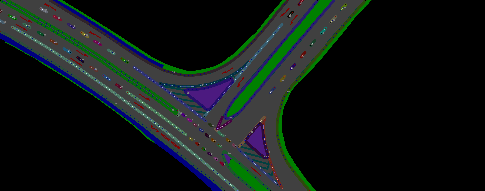

<p align="center"></p>

<p style="font-weight: bold; text-align:center;">DeepAerialMapper is an open-source project to semi-automatically convert segmentation masks of aerial imagery into High-Definition maps (<i>HD maps</i>). <br>
Authors: Robert Krajewski, Huijo Kim </p>


## Introduction

HD maps help highly automated vehicles to understand their surroundings and localize themselves precisely. 
Conventional methods to obtain up-to-date maps through dedicated measurement vehicles are costly and time-intensive.
Compared to that, high-resolution aerial imagery exists in ever-increasing quantities and is sometimes even made available free of charge, but usually requires extensive manual work to create maps from them.
To overcome this issue, we propose a semi-automatic approach to create HD maps from high-resolution aerial imagery.
In the first step, the aerial image of a road section is semantically segmented by a neural network so that each pixel is assigned to one of several predefined categories (e.g. road, lane marking, symbol, footpath, ...).
In the second step, a prototypical HD map is derived from this semantic mask by gradually locating, analysing, classifying and grouping lane boundaries, lane markings and symbols into lanes.
The code in this repository contains all the code for the second step.
Since the resulting map is exported in the [lanelet2](https://www.mrt.kit.edu/z/publ/download/2018/Poggenhans2018Lanelet2.pdf) format, it can then be easily viewed and modified through common tools such as [JOSM](https://josm.openstreetmap.de/).

This work is based on our *paper*. You can find [arXiv version of the paper here](https://www.arxiv.org/abs/2410.00769)  </br>

### Get Started

In this quick tutorial, you will learn how to install DeepAerialMapper and how to create your first HDMap.

We also offer a [more detailed tutorial](docs/tutorial.md) and a [guide on reproducing the results of our paper](docs/evaluate.md).

#### 1. Installation

The code has been written in Python and is tested with Python 3.9 and 3.10 on Windows and Linux.

```bash
# Optional: Create a separate conda environment
conda create --name DAM python=3.10
conda activate DAM

# Clone repository
git clone https://github.com/RobertKrajewski/DeepAerialMapper.git DeepAerialMapper
cd DeepAerialMapper

# Install in editable mode that allows modifications to the code without reinstallation
pip install -e .

# Optional: If you want to execute the tests, install pytest
pip install pytest
```

#### 2. Map Creation

For creating a map of the demo image provided in `data/demo/`, we use the `bin/create_maps.py` script.
The location of the data and parameters are given in the `configs/demo.yaml` 

```bash
# Run this script from the project root directory
python3 bin/create_maps.py  --output-dir=results/maps/demo configs/demo.yaml
```

#### 3. Results

After the script has finished executing, you can find the results in `results/maps/demo`.
Here is an overview of the most important files:
```
demo
├── demo.osm --> Lanelet2 map stored in the OpenStreetMap format. Can be opened/edited e.g. using JOSM.
├── demolanemarkings.png  --> Image showing the lanemarkings before grouping
├── demolanemarkings_post.png  --> Image showing the lanemarkings after grouping
└── log.txt --> Logs written to terminal during map creation
```

<figure align="left">
<figcaption>Visualization of lanelets before grouping</figcaption>

</figure>

<figure align="left">
<figcaption>Visualization of lanelets after grouping</figcaption>

</figure>

## Citation
```
% Paper
@misc{dam2024paper,
    title={{DeepAerialMapper}: Deep Learning-based Semi-automatic HD Map Creation for Highly Automated Vehicles},
    author={Robert Krajewski, Huijo Kim},
    howpublished = {\url{https://www.arxiv.org/abs/2410.00769}},
    year={2024}
}

% Code
@misc{dam2024code,
    title={{DeepAerialMapper}: Semi-Automatically Convert Segmentation Masks of Aerial Imagery into High-Definition Maps},
    author={Robert Krajewski, Huijo Kim},
    howpublished = {\url{https://github.com/RobertKrajewski/DeepAerialMapper}},
    year={2024}
}
```
## License
This project is released under the [GPLv3](https://www.gnu.org/licenses/gpl-3.0.en.html).