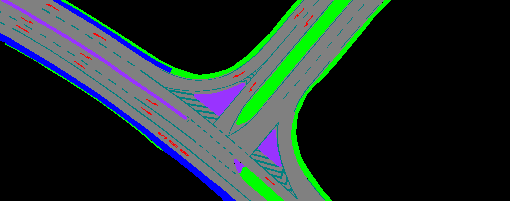

## Installation
``` bash
conda create --name DAM python=3.10
conda activate DAM
git clone https://github.com/RobertKrajewski/DeepAerialMapper.git DeepAerialMapper
cd DeepAerialMapper
python3 setup.py install
```

## Tutorial
1. Prepare segmentation mask 


2. Define the palette of each mask in `configs/mask/config.yaml`
Higher priority means more important class. i.e. LANEMARKING has priority over BLACK. \
Select the corresponding mask color of class.
``` yaml
class:
  - type: BLACK
    priority: 0
    palette: [0, 0, 0]
  - type: ROAD
    priority: 1
    palette: [128, 128, 128]
  - type: VEGETATION
    priority: 2
    palette: [0, 255, 0]
  - type: TRAFFICISLAND
    priority: 3
    palette: [153, 51, 255]
  - type: SIDEWALK
    priority: 4
    palette: [0, 0, 255]
  - type: PARKING
    priority: 5
    palette: [255, 255, 0]
  - type: SYMBOL
    priority: 6
    palette: [255, 0, 0]
  - type: LANEMARKING
    priority: 7
    palette: [0, 128, 128]
```

3. Run DeepAerialMapper algorithm
``` bash
python3 tools/create_maps.py --input data/seg_masks
```

## Hyper Parameters
Performance of extracting and grouping lanelets depends on several parameters. \
TODO: Keep every hyperparameter into config file. \
TODO: Introduction for meta