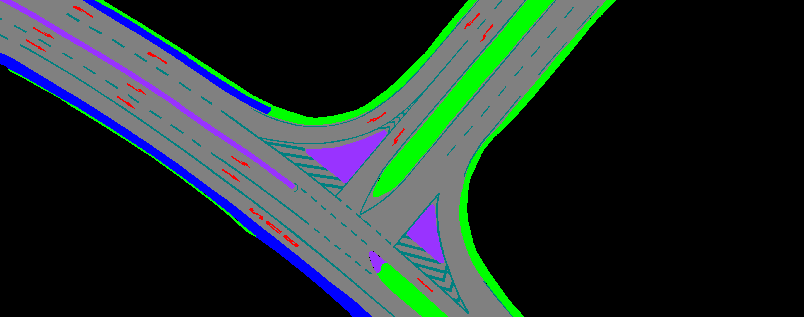
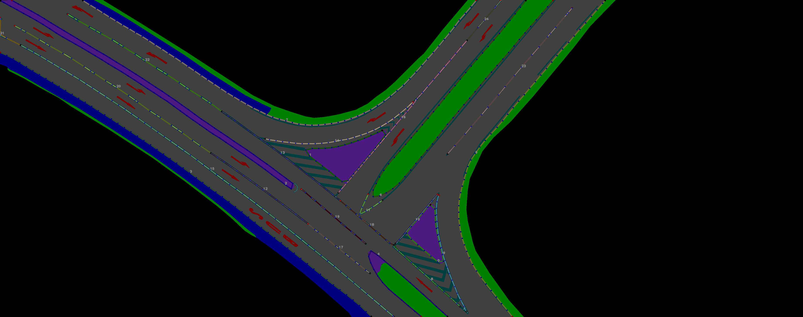

# Tutorial

This tutorial is similar to the "Get Started" Section in the `README.md` but gives details about how you can use your own data. 
Please install DAM before continuing (see `README.md`).

## 1. Segmentation Masks
As input the mapping algorithms require segmentation masks of road sections. 


These can be created e.g. by training a neural network to perform the semantic segmentation of aerial imagery.
(Please note that we won't provide our network).

Currently, eight semantic classes are supported:
* **BLACK**: E.g. irrelevant areas that are too distant from the road
* **ROAD**: E.g. all kind of roads
* **VEGETATION**: E.g. grass between a road and a sidewalk
* **TRAFFICISLAND**: E.g. Paved area on road used only by pedestrians to cross roads.
* **SIDEWALK**: E.g. all kind of sidewalks that are not shared with cars
* **PARKING**: E.g. Parking spot next to a road
* **SYMBOL**: E.g. turning arrows 
* **LANEMARKING**: E.g. Dashed or solid lane markings

When creating semantic segmentation masks, it is recommended to use the `.png` file format to avoid compression artifacts changing colors.

## 2. Config
Map creation can be fully controlled through a config that is stored as a `.yaml` file.
The file either specifies parameters directly or links to other files containing data or other information.

Here is an overview of the most important parameters:
* `mask_dir_path`: Relative path to the directory that contains the semantic segmentation masks (`.png` files) to process
* `meta_filepath`: (Optional) Relative path to the `.yaml` file containing meta information about the segmentation masks, e.g. long/lat locations.
* `ignore_regions_filepath`: (Optional) Relative path to the `.json` file containing areas to be excluded from map generation. This file can be created using the [via-annotator]((https://www.robots.ox.ac.uk/~vgg/software/via/via.html).
* `palette`: Color palette that maps colors in the segmentation masks to classes. Warning: The order matters!
* `symbol_detector`:
  * `symbol_names`: List of output classes of the symbol detector
  * `classifier_weight_filepath`: Relative path to a file containing the weights of the classification network used. (Note: Code and data for training the network are not included!)
* Other parameters: There are more parameters that change the behaviour of the algorithms used. Please check the code for them.

## 3. Map Creation

For creating a map of the demo image provided in `data/demo/`, we use the `bin/create_maps.py` script.
The location of the data and parameters are given in the `configs/demo.yaml` 

```bash
# Run this script from the project root directory
python3 bin/create_maps.py  --output-dir=results/maps/demo configs/demo.yaml
```

## 4. Results

After the script has finished executing, you can find the results in `results/maps/demo`.
Here is an overview of the most important files:
```
demo
├── demo.osm --> Lanelet2 map stored in the OpenStreetMap format. Can be opened/edited e.g. using JOSM.
├── demolanemarkings.png  --> Image showing the lanemarkings before grouping
├── demolanemarkings_post.png  --> Image showing the lanemarkings after grouping
└── log.txt --> Logs written to terminal during map creation
```

<figure align="left">
<figcaption>Visualization of lanelets</figcaption>

</figure>
